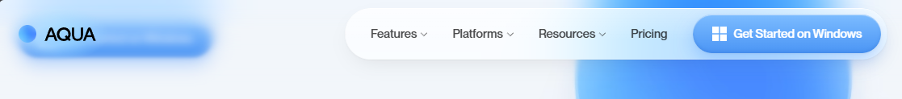
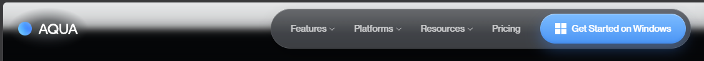
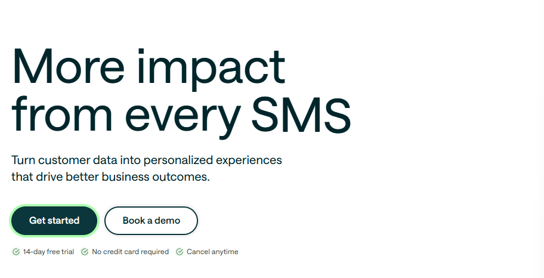
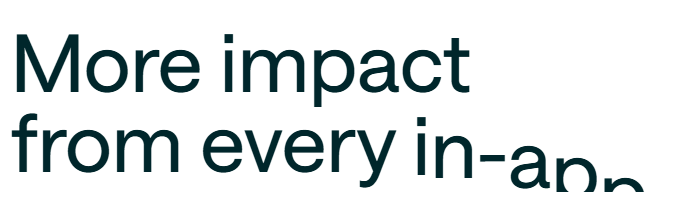
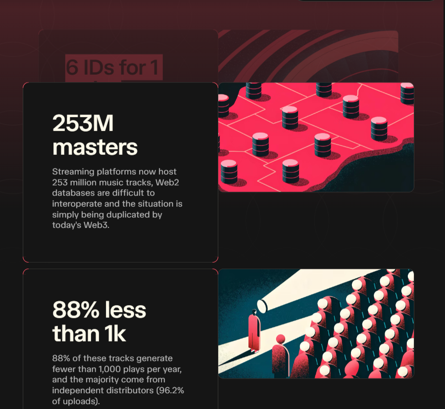
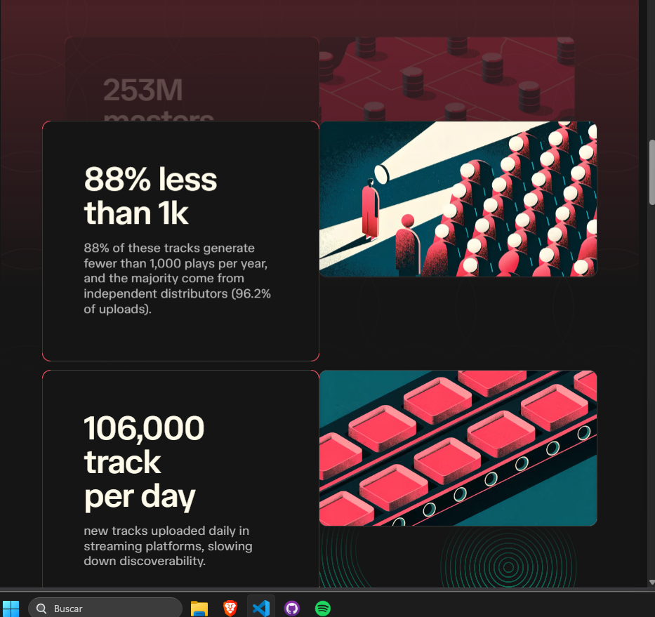
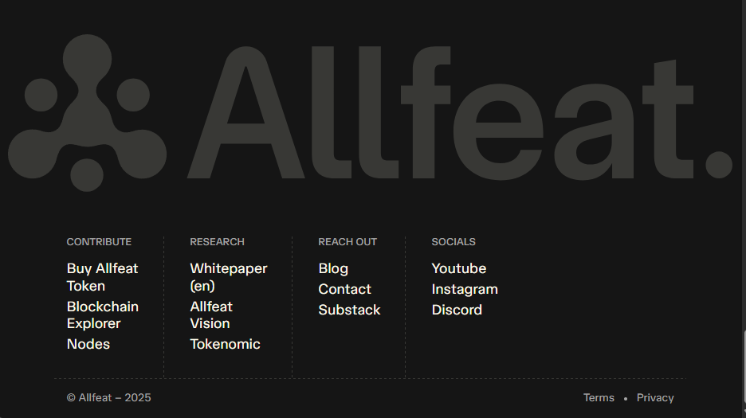

# Es necesario pulir la propuesta actual, a esto le falta movimiento, identidad y atracción al usuario. 

# Hago una recopilación de componentes que me gustan de un par de páginas que encontré por ahí. 

### Me gusta como presenta el navbar transparente https://aquavoice.com/
 

### Me gusta mucho el cambio de palabras del header de https://customer.io/ 
 

### me gusta tambien la estructura general de https://www.moderntreasury.com/. creo que como presenta su header más su animación inicial es un buen encanche. Tambien el como presenta sus cards y la paleta de colores de este.

### de https://allfeat.org/ me gusta como presenta las cards de sus características  al igual que su footer 

quiero que busques las páginas web de las referencias y haz lo mejor posible para que los efectos sean lo más parecidos posibles. los difuminados de la transparencia que no sean bruscos, deben ser como la referencia. Que el efecto de cambio de palabra salga igual a la referencia, con una cascada de letras que vayan saliendo de desde abajo e inmediatamente lleguen otras letras.

cuando termines sube tus cambios a la rama de rediseño/diego